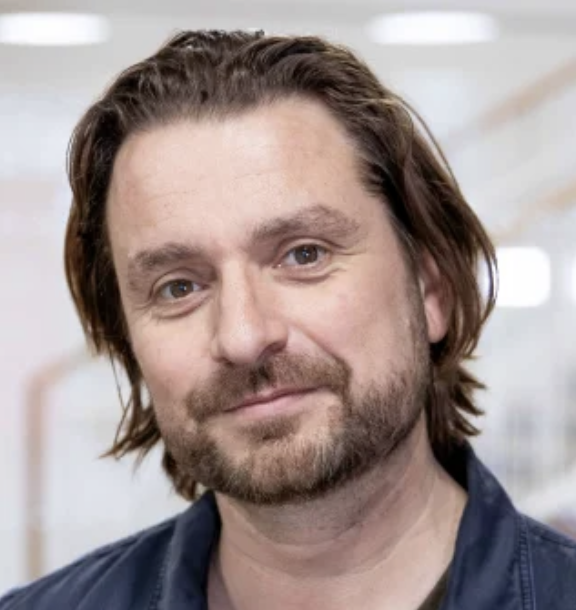
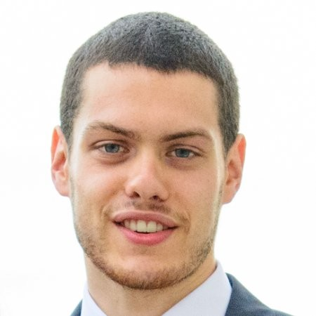
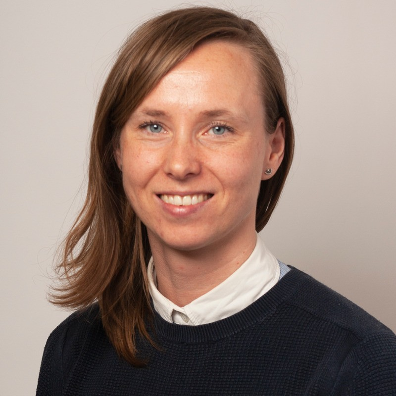
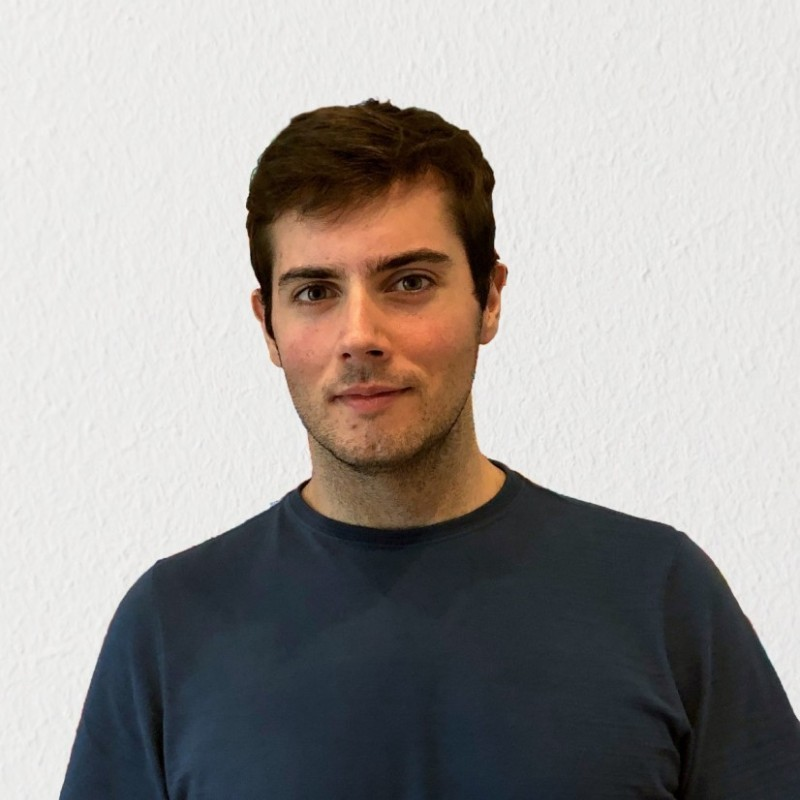
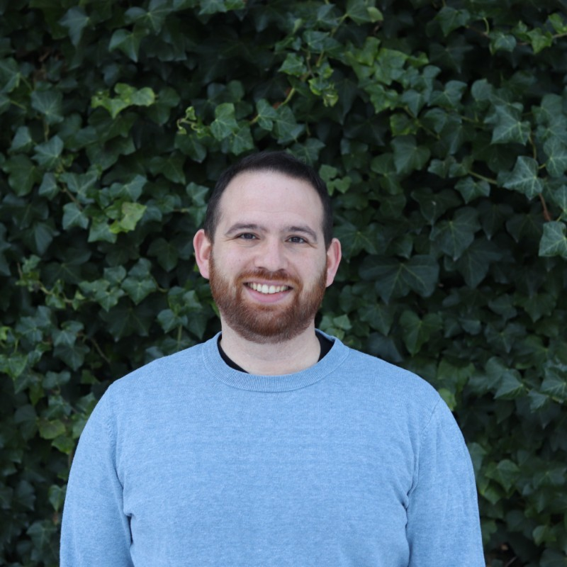
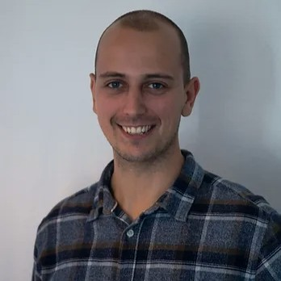

We organize the cafe as a collaboration between the [Bioinformatics Research Center](https://birc.au.dk) and the [Core Bioinformatics Facility](https://biomed.au.dk/bioinformatics-core-facility).

Our shared email address for general enquiries about the cafe is `abc.focus at au.dk`.

# Behind the ABC - Who we are

| People | What do I do |
|------- |--------- |
| {width=200px}| **Per Qvist**: Ass.Prof. at AU biomed, leads as well the Core Bioinformatics Facility. Most importantly, has been managing constant cake and drinks flow to the ABC, which has been making him invaluable to all participants!         |
|{width=200px}| **Samuele Soraggi**: Special consultant at the department of bioinformatics after a migration from the field of mathematics. He often throws himself to unknown buggy pieces of code with duct tape and a hammer until they work. |
|{width=200px}| **Marie Sønderstrup**: Phd Student at The department of biomedicine. Is the inspirator of the ABC, after living through the deep frustration of understanding how to code. |
|{width=200px}| **Manuel Peral Vazquez**: Phd Student at Department of Molecular Biology and Genetics - Cellular Health, Intervention, and Nutrition. He loves to dig into the amenities of the bash command line and trying out interesting things. |
|{width=200px}| **Dimitrios Pediotidis-Maniatis**: Consultant at the bioinformatics core facility. Probably the person with the highest attendance to the ABC! He masters a lot of things in `bash` and `R` - test him out!|
|{width=200px}| **jacob Egemose Høgfeldt**: He is also consultant at the bioinformatics core facility, and knows a great deal of bioinformatics and data science. He is the absolute go-to person for bulkRNA sequencing questions together with Dimitrios. |

