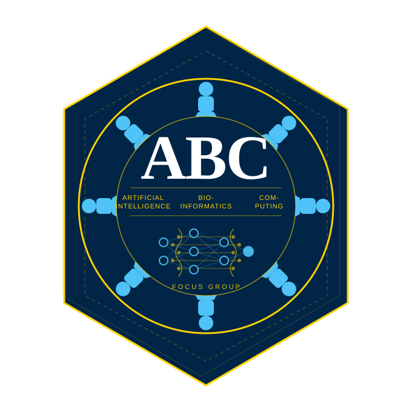

:::{.callout-note title="" icon=false appearance="simple"}
{fig-align="center" width=300px}

# [A]{style="font-size:1.4em"}I, [B]{style="font-size:1.4em"}ioinformatics and [C]{style="font-size:1.4em"}omputing {.centered}

A focus group of the HealthAI and Personalized medicine networks at Aarhus university, Faculty of Health

:::

&nbsp;

## The world is changing, and so is the way we study and do research

The rapid advancement and shift to new ways of exploiting data and information has created a need for new skills and knowledge. Bioinformatics and data science go hand in hand with an increasingly computational approach to research, and the ability to code is becoming a fundamental skill for many researchers, while AI and agentic computing are more and more becoming determinant in the way we do research.

All of this requires an increased focus on new skills, both technical and conceptual, without forgetting a higher level of critical thinking, understanding potential applications, and the ability to understand how research is enhanced by these new tools and methodologies.

## What is the ABC?

The ABC is a focus group part of the HealthAI and Personalized medicine networks at Aarhus University. The scope is to introduce, facilitate and upskill the use of AI, bioinformatics, and computing for all users, being them students, researchers, or staff. 

We propose a relaxed environment with a wide range of talks, workshops, and open floor sessions where you can get help with coding and bioinformatics issues, learn new things, and meet other people with similar interests.

## Event tracks

Events are organized in three distinct tracks:

1. **Topical research talks** - where are we heading? Inspiring presentations from local or external researchers and professionals to present their line of work, share their experiences, and discuss the use of AI, bioinformatics, and computing in their research.
2. **Workshops** - Demos and/or hands-on workshops covering the ABC topics, where you can learn new skills and get hands-on experience with AI, bioinformatics, and computing.
3. **Coding Cafe** - a relaxed environment where you can get help with coding and bioinformatics issues, learn new things, and meet other people with similar interests. The cafe is open to all, and you can come with your own questions or just to listen and learn from others.

## Who can benefit from the ABC?
 
Everyone, really. Those that will particularly benefit from the ABC include:

- Biologists, bioinformaticians, and health scientists who wish to adopt or upskill in coding-based solutions, LLM-driven methods and AI tools.
- Scientists and students who wish to accelerate the coding-based analysis of various types of data (such as OMICs data and other large-scale data).
- Students and researchers who want an open environment where it is easy to get assistance and talk with others encountering similar issues (or maybe who already solved them!)

## When and where

Look at our [Events calendar](./calendar.qmd) for more information about each meeting of the focus group. Work in progress.

## Newsletter

Subscribe to our newsletter to receive a few, non-invasive reminders for our meetings and events!

## Funding
For all of 2026 we are supported by the [Danish Data Science Academy](https://ddsa.dk/).
